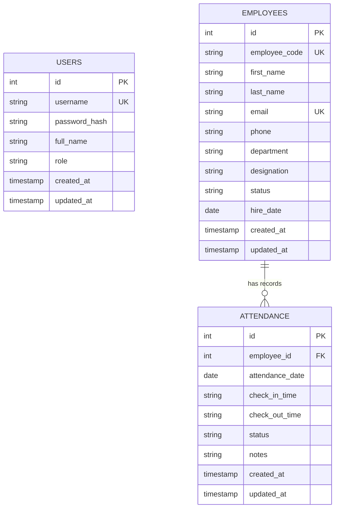

# Mini Attendance Management System 🚀
**Twite AI Technologies Engineering Assessment**

A complete, enterprise-grade **Mini Attendance Management System** built with **Node.js, Express, SQLite / SQL Database, React.js, Vite, and Swagger OpenAPI**. 

---

## 🌟 Executive Features & Highlights

- 🔐 **Module 1: Authentication & RBAC**: JWT Token-based authentication supporting `Admin` and `Manager` roles.
- 👥 **Module 2: Employee Management**: Full CRUD operations for employees with real-time search, department filtering, status toggling, sorting, and pagination.
- 📅 **Module 3: Attendance Tracking**: Single & Quick Mark Attendance (Check-in, Check-out, Status), employee-wise historical logs, daily summary stats, and attendance percentages.
- 📊 **Module 4: Dashboard Analytics**: Executive summary cards, 7-day attendance trend area charts, department distribution progress bars, and live status breakdown.
- 📄 **Report Export**: CSV stream exporter with date range and status filters for payroll and audit.
- 📖 **Interactive Swagger UI**: Full OpenAPI 3.0 documentation available at `http://localhost:5000/api-docs`.
- 🧪 **Automated Testing Suite**: Integration and unit tests using Jest and Supertest.
- 🐳 **Dockerized Setup**: Containerized multi-stage Docker build and Docker Compose configuration.

---

## 🛠️ Technology Stack

| Layer | Technology |
| :--- | :--- |
| **Frontend** | React 18, Vite, Lucide React Icons, Recharts Analytics, Modern CSS (Glassmorphism + Neon Theme) |
| **Backend** | Node.js, Express.js, JWT (`jsonwebtoken`), Bcrypt (`bcryptjs`), Helmet, Cors, Morgan |
| **Database** | SQLite Engine (Zero-dependency local execution) + Standard SQL DDL (`schema.sql` & `seed.sql`) |
| **API Spec & Testing** | OpenAPI 3.0 / Swagger UI, Jest, Supertest |
| **Containerization** | Docker, Docker Compose |

---

## 🗄️ Database Architecture & ERD Diagram

The database schema is fully normalized with primary keys, foreign keys, cascade constraints, unique indexes, and audit fields (`created_at`, `updated_at`).



---

## 🚀 Quick Start & Setup Instructions

### Prerequisites
- **Node.js**: v18.0.0 or higher (`node -v`)
- **npm**: v9.0.0 or higher (`npm -v`)

---

### Step 1: Clone Repository & Setup Backend

```bash
# Navigate to backend directory
cd backend

# Install backend dependencies
npm install

# Run automated Jest unit & integration tests
npm test

# Start backend server in development mode
npm run dev
```
> 📡 **Backend API Server**: Runs on `http://localhost:5000`  
> 📖 **Swagger API Docs**: Accessible at `http://localhost:5000/api-docs`

---

### Step 2: Setup Frontend Application

Open a new terminal window:

```bash
# Navigate to frontend directory
cd frontend

# Install frontend dependencies
npm install

# Start React dev server
npm run dev
```
> 💻 **Frontend Application**: Runs on `http://localhost:3000`

---

### 🗝️ Default Login Credentials (Demo Accounts)

| Role | Username | Password | Access Rights |
| :--- | :--- | :--- | :--- |
| **Administrator** | `admin` | `admin123` | Full Access (Create/Edit/Delete Employees & Attendance) |
| **HR Manager** | `manager` | `manager123` | Create/Edit Employees & Mark Attendance |

---

## 🐳 Docker Deployment

To spin up the entire application stack in containerized mode with Docker Compose:

```bash
# Build and run containers
docker-compose up --build
```
Access the application at `http://localhost:5000`.

---

## 📑 REST API Documentation Summary

| Method | Endpoint | Description | Protected | Roles |
| :--- | :--- | :--- | :---: | :--- |
| `POST` | `/api/auth/login` | Authenticate user & issue JWT | ❌ | All |
| `GET` | `/api/auth/me` | Fetch authenticated user profile | ✅ | All |
| `GET` | `/api/employees` | List employees (Search, Filter, Paginate, Sort) | ✅ | All |
| `POST` | `/api/employees` | Create new employee | ✅ | Admin, Manager |
| `GET` | `/api/employees/:id` | Get employee details & attendance % stats | ✅ | All |
| `PUT` | `/api/employees/:id` | Update employee record | ✅ | Admin, Manager |
| `DELETE` | `/api/employees/:id` | Delete employee record | ✅ | Admin |
| `GET` | `/api/attendance` | List attendance logs by date/filter | ✅ | All |
| `POST` | `/api/attendance` | Mark / Update employee attendance | ✅ | Admin, Manager |
| `GET` | `/api/attendance/summary` | Get aggregated metrics & present % | ✅ | All |
| `GET` | `/api/attendance/employee/:id` | Get employee historical attendance | ✅ | All |
| `GET` | `/api/dashboard/stats` | Key metrics, department breakdown & trends | ✅ | All |
| `GET` | `/api/reports/export-attendance` | Stream CSV export report | ✅ | All |

---

## 🎓 Technical Review Round 2 - Live Enhancement Guide

During Round 2 with the Twite AI Engineering Team, candidates may be asked to execute quick live enhancements. Below is how each potential requirement is pre-engineered in this codebase:

1. **Add Department Filter**: Pre-built in `GET /api/employees?department=Engineering` and UI select dropdowns.
2. **Add Attendance Percentage**: Pre-calculated dynamically per employee (`attendanceStats.attendancePercentage`) and across departments on the Dashboard.
3. **Add Employee Status Filter**: Supported on both API (`GET /api/employees?status=Active`) and UI filter toolbar.
4. **Add Export Feature**: Pre-implemented at `/api/reports/export-attendance` with instant CSV stream download.

---

## 📄 License & Attribution
Designed and built for **Twite AI Technologies** Software Engineering Assessment.
